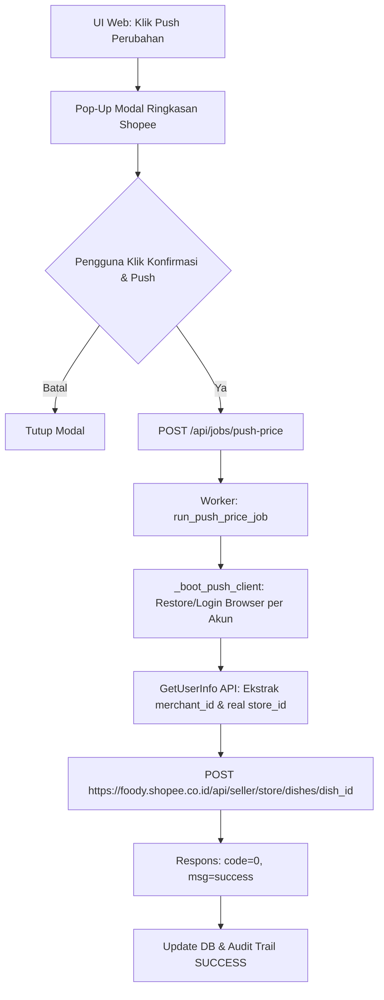

# Dokumentasi Alur & Perubahan Push Harga Shopee Partner

Dokumen ini mencatat secara lengkap arsitektur, alur kerja, penanganan bug, serta spesifikasi API untuk pembaruan (PUSH) harga menu pada portal Shopee Partner.

---

## 1. Ikhtisar Arsitektur PUSH Harga

Proses PUSH harga Shopee dirancang simetris dengan alur PULL menu, menggunakan kredensial outlet spesifik (Username & Password dari Kolom Q/S GSheet, contoh: `superfoodapp`) dan mengelola sesi browser terisolasi per akun.



---

## 2. Fitur UI: Pop-up Ringkasan Konfirmasi Push

### Berkas Terkait:
- [`web/src/components/ShopeeEditHargaTab.jsx`](file:///home/asya/Downloads/get%20menu%20outlet/web/src/components/ShopeeEditHargaTab.jsx)

### Deskripsi Fitur:
Sebelum job dikirim ke server, pengguna disajikan **Rich Confirmation Summary Modal** yang menampilkan:
- Nama Outlet / Merchant.
- Daftar item yang mengalami perubahan harga.
- Harga Lama vs Harga Baru.
- Persentase perubahan (`+` / `- %`).
- Peringatan visual (`! Batas Shopee`) jika perubahan melebihi ambang batas toleransi Shopee (25%).
- Tombol **"Batal"** dan **"Konfirmasi & Push Update"**.

Setelah konfirmasi diberikan, **Success Modal** ("Update Shopee mulai diproses") akan memberikan instruksi visual bahwa pembaruan sedang dikirim dan status job dapat dipantau pada bagian bawah tabel.

---

## 3. Penanganan Masalah & Root Cause Analysis

### 3.1. Error `need to select a store` & Mis-match Store ID (Code: 1130002)
- **Penyebab**: 
  1. Shopee Partner memisahkan konsep **Merchant ID** (`shopee_foody_mid`) dan **Store ID** (`shopee_tob_entity_id`). Contoh untuk outlet SuperFood:
     - `merchant_id`: `11511947` (ID Brand / Merchant utama)
     - `store_id`: `22459819` (ID Outlet / Toko fisik `Superfood (test)`) atau `22519125` (`SuperFood`).
  2. Saat bot memanggil `GetUserInfo`, API mengembalikan `store_id` default akun (`22519125`). Jika `store_id` tersebut menimpa `store_id` spesifik milik outlet dari DB (`22459819`), item menu yang dicari tidak ditemukan sehingga `CatalogID` bernilai `"0"`, memicu validasi error Shopee (`CatalogID failed on the 'gt' tag`).
- **Solusi**: 
  - `_boot_push_client` di [`shopee/core/push.py`](file:///home/asya/Downloads/get%20menu%20outlet/shopee/core/push.py) sekarang mempertahankan `store_id` dari DB (`22459819`) jika tersedia dan tidak meng-overwritenya.
  - Ditambahkan **Fallback Target Name**: Jika `target_name` internal DB (misal `Superfood (test)`) tidak cocok dengan string dropdown portal Shopee (`SuperFood`), `_boot_push_client` secara otomatis melakukan fallback `get_session(target_name="")` untuk mengekstrak token secara langsung tanpa gagal `MERCHANT_NOT_FOUND`.

### 3.2. Error `auth_failed` (Code: 3004)
- **Penyebab**: Pemanggilan endpoint API `foody.shopee.co.id` dari Python `requests` tanpa menyertakan kombinasi header `x-merchant-token`, `x-merchant-id`, dan cookie `shopee_user_name`.
- **Solusi**: [`ShopeeModifyClient._seller_headers`](file:///home/asya/Downloads/get%20menu%20outlet/shopee/core/client.py) diperbarui untuk secara otomatis menyuntikkan:
  - Header: `x-merchant-token`, `x-merchant-id`, `shopee_tob_entity_id`
  - Cookie: `shopee_tob_token`, `shopee_user_name`, `shopee_foody_mid`, `shopee_tob_entity_id`, `shopee_request_from=partner_web`

### 3.3. Error Format JSON Go Backend (Code: 2 / Validation Error)
- **Penyebab**: Unmarshaler Shopee Go Backend (`EditDishRequest.Dish`) membutuhkan tipe data spesifik untuk masing-masing atribut.
- **Solusi**: Di [`shopee/core/create.py`](file:///home/asya/Downloads/get%20menu%20outlet/shopee/core/create.py) (`_build_dish_payload`), pembentukan payload disesuaikan secara ketat:
  - Wrapped dalam objek `{"dish": ...}`
  - `price`: String (contoh `"3400000000"`)
  - `list_price`: Integer Number (contoh `3400000000`)
  - `catalog_id`, `id`, `store_id`: String

---

## 4. Spesifikasi API Endpoint PUSH Harga

### Endpoint:
`POST https://foody.shopee.co.id/api/seller/store/dishes/{dish_id}`

### Headers Wajib:
```http
Host: foody.shopee.co.id
Accept: application/json, text/plain, */*
Content-Type: application/json
User-Agent: Mozilla/5.0 (X11; Linux x86_64) AppleWebKit/537.36 (KHTML, like Gecko) Chrome/147.0.0.0 Safari/537.36
X-Sf-Platform: 2
Operate-Source: partnerapp
Origin: https://partner.shopee.co.id
Referer: https://partner.shopee.co.id/
x-merchant-token: {shopee_tob_token}
x-merchant-id: {merchant_id}
shopee_tob_entity_id: {store_id}
Cookie: shopee_tob_token={tob_token}; shopee_request_from=partner_web; shopee_user_name={username}; shopee_foody_mid={merchant_id}; shopee_tob_entity_id={store_id}
```

### Format Payload JSON:
```json
{
  "dish": {
    "id": "2839852835391488",
    "store_id": "22519125",
    "catalog_id": "2839852835063808",
    "name": "Nasi Ayam Crispy Lemon Pedas",
    "price": "3400000000",
    "list_price": 3400000000,
    "description": "",
    "available": true,
    "listing_status": 1,
    "sale_status": 1,
    "sale_week_bit": 127,
    "time_for_sales": [
      {
        "sale_start_time": 0,
        "sale_end_time": 86399
      }
    ],
    "rank": 1,
    "option_groups": []
  }
}
```

### Respons Berhasil (Code: 0):
```json
{
  "code": 0,
  "msg": "success",
  "data": {
    "failed_group_ids": [],
    "auto_qc_result": 0,
    "failed_fields": [],
    "change_percent_limit": 25
  }
}
```

---

## 5. Ringkasan Modul Terkait

| Berkas | Fungsi Utama |
| :--- | :--- |
| [`shopee/core/push.py`](file:///home/asya/Downloads/get%20menu%20outlet/shopee/core/push.py) | Boot client presisi per akun/outlet, resolusi `store_id` via `GetUserInfo`, dan pemicuan `push_price_update_dish`. |
| [`shopee/core/client.py`](file:///home/asya/Downloads/get%20menu%20outlet/shopee/core/client.py) | Penanganan kelas `ShopeeModifyClient` dan pembuatan header `_seller_headers`. |
| [`shopee/core/create.py`](file:///home/asya/Downloads/get%20menu%20outlet/shopee/core/create.py) | Pembangun payload `_build_dish_payload` dengan skema Go struct. |
| [`shopee/core/edit.py`](file:///home/asya/Downloads/get%20menu%20outlet/shopee/core/edit.py) | Fungsi `update_dish` dengan pengiriman request ke endpoint `/dishes/{dish_id}`. |
| [`web/src/components/ShopeeEditHargaTab.jsx`](file:///home/asya/Downloads/get%20menu%20outlet/web/src/components/ShopeeEditHargaTab.jsx) | Komponen UI tab Edit Harga Shopee, Pop-Up Confirmation Modal, dan Polling OTP. |
